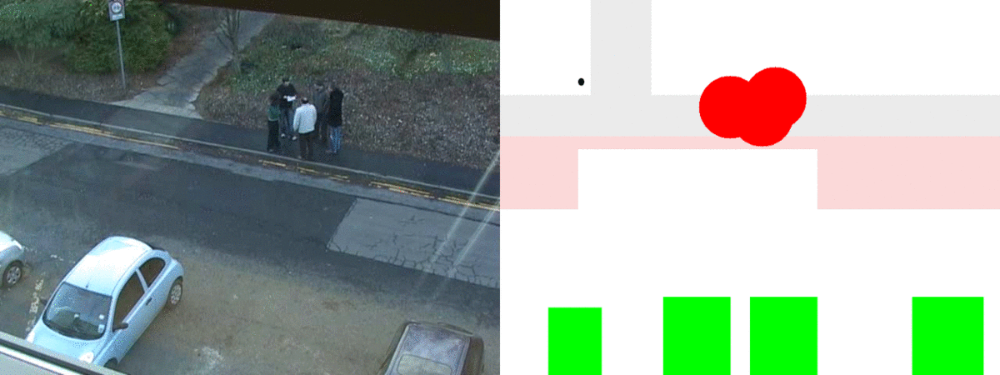

# Keep Your Distance (KYD project)

Il progetto KYD consiste nell'utilizzo di algoritmi di Machine Learning per la _detection_ di persone al fine di stimare 
la distanza interpersonale tra queste e quindi attivare allarmi qualora questa distanza risulti essere troppo bassa (inferiore ad 1 m).

Il progetto si basa su due applicazioni, una basata su una rete di nodi fissi, che monitorano una zona predefinita (ad es. parco,
scuola, supermercato, centro commerciale, ecc.), rilevando la posizione al suolo delle persone monitorate e quindi calcolandone
la distanza relativa. Una seconda basata invece e' basata su un singolo nodo in grado, come la precedente, di stimare la posizione 
delle persone monitorate e in aggiunta anche la distanza tra queste. Di seguito mostriamo alcuni risultati preliminari delle due applicazioni
chiamate rispettivamente **KYD** e **KYD mobile**.

## KYD
Qui di seguito vediamo alcuni esempi dell'algoritmo applicato ad un video pubblico scaricabile [qui](http://groups.inf.ed.ac.uk/vision/BEHAVEDATA/INTERACTIONS/).

